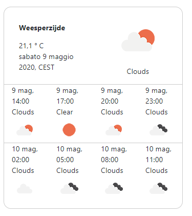

# Open Weather App (dockerized)

## Based on Open Weather APIs and built with Lumen (7.1.1) and Vue.js v2.6.11

### Description
Open Weather App consumes Open Weather Map APIs in order to show the current weather condition and the forecast (today and tomorrow) based on the device geolocation. You must enable your device geolocation to allow the script make a request for the right position.

### Installation
```
git clone https://github.com/gmaccario/open_weather_app.git open-weather-app
cd open-weather-app
docker-compose up -d
docker exec -it weather-app-php /bin/bash
composer install
```

### Get your app id
Open https://openweathermap.org/appid and get you APPID. Then:
```
cp .env.example .env
```
Edit .env and replace YOUR-APP-ID with your Open Weather Map app id.

Open http://localhost on your browser.

### Todo
* Add fontawesome
* Save history

### Valid HTML
https://validator.w3.org/
Document checking completed. No errors or warnings to show.

### Author
Giuseppe Maccario

### Author URI
[https://www.giuseppemaccario.com](https://www.giuseppemaccario.com "Giuseppe Maccario")

### Screenshot


### Notes
* api.openweathermap.org/data/2.5/weather?lat={lat}&lon={lon}&appid={your api key}
* api.openweathermap.org/data/2.5/forecast?lat=52.3728583&lon=4.938827799999999&appid=<app-id>
* https:openweathermap.org/price
* https:maps.owm.io/map/wind_new/13/52.3728583/4.938827799999999&.png?appid=<app-id>

* https://www.php.net/manual/en/features.http-auth.php
* https://stackoverflow.com/questions/3323245/is-basic-access-authentication-secure
